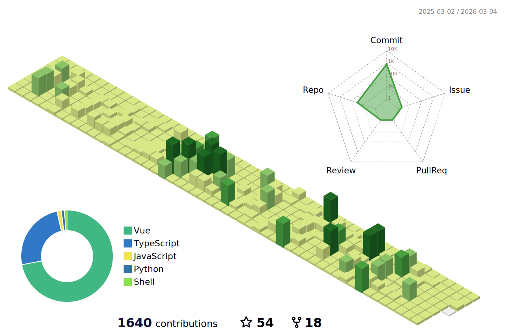

### Hi there 👋

- 👋 嗨，我是张云山，很高兴在GitHub与您相识
- 👨‍💻 我是一位居住在宁波的web工程师，擅长`vue`、`nodejs`等
- 🌱 我目前专注于`vue`、`nodejs`
- 👉 [这里](https://zys8119.github.io/zys8119-Demo) 是我的博客, [这里](https://zys8119.github.io/zys8119/)是个人特效
- 📫 如何联系我:770959294@qq.com

### 贡献项目

### 个人资料视图

此部分此页面的访问者计数从 2024 年 12 月 10 日开始

</img>

## 技术 💻

  <h3 align="center"> 
    Visitors Count 
    
  </h3>

<!--
- 👋 我：嗨，我是张云山，很高兴在GitHub与您相识
- 🔭 我的技能：
- 🌱 我目前正在学习…
- 👯 我希望合作…
- 🤔 我正在寻求帮助…
- 💬 问我关于…
- 📫 如何联系我:…
- 😄 代词:…
- ⚡ 有趣的事实:…
- - 👋 Hi, I’m mxsm(蚂蚁背大象)，Graduated from ***Hangzhou Dianzi University(HDU)***.
- 👨‍💻 A Software Engineer living in Foshan. Working in Guangzhou. ***Good at JAVA, Rustaceans***
- 🌱 I’m currently focused on [***Apache RocketMQ***](https://github.com/apache/rocketmq), [***Apache EventMesh***](https://github.com/apache/eventmesh), [***RocketMQ-Rust***](https://github.com/mxsm/rocketmq-rust) and [***DLedger***](https://github.com/openmessaging/dledger).
- 📚 I’m currently learning English and Rust.
- 👉 [Here](https://blog.ljbmxsm.com) is my personal website. Here is my [juejin Home page ](https://juejin.cn/user/1151943918492855)
- 📫 How to reach me: mxsm@apache.org or ljbmxsm@163.com 
-->

